# 🎯 鲜小智生鲜买菜系统

> 一个基于 SpringBoot + 微信小程序原生 + Vue 管理后台 的生鲜购物超市。
> 具体项目设计请看：需求分析.md

### ✨ 技术栈
后端：
- Java 17+
- SpringBoot 3.4.5
- MyBatis Plus 3.5.6
- MySQL 8.x
- Redis 6.x+
- SpringAI 1.1.5
- jjwt 0.12.5
- OSS 3.17.4
- Hutool 5.8.26
- Lombok -

小程序端：微信小程序原生（WXML + WXSS + JS）
管理端：Vue3 + Element Plus

### 🚀 快速启动
1. 工具下载：下载 git 和 node.js
2. 克隆代码：`git clone https://github.com/RainBowVV/fresh-xiaozhi`
3. 完善 application.yml 资源配置
4. 下载依赖
```bash
cd miniapp/
npm install
```
5. 替换 project.config.json 中的 appid

### 📸 项目展示

鲜小智小程序：

首页 :arrow_right: 商品详情 :arrow_right: 购物车
 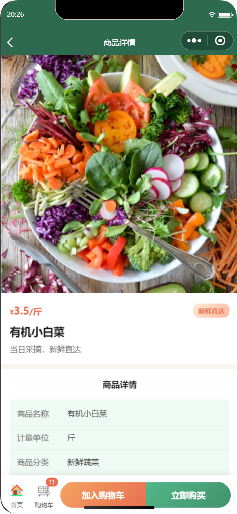 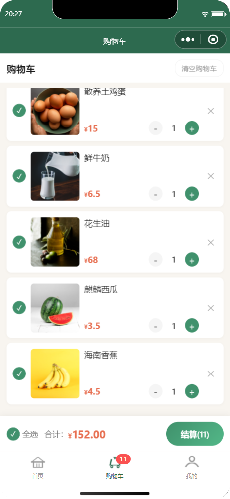

登录 :arrow_right: 我的 :arrow_right: AI智能客服
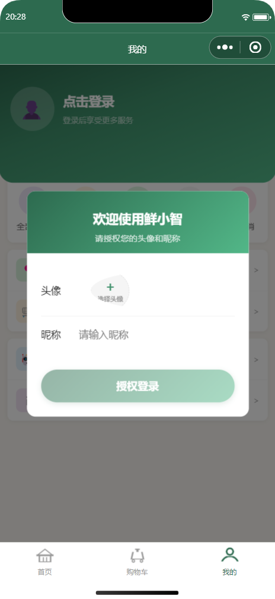  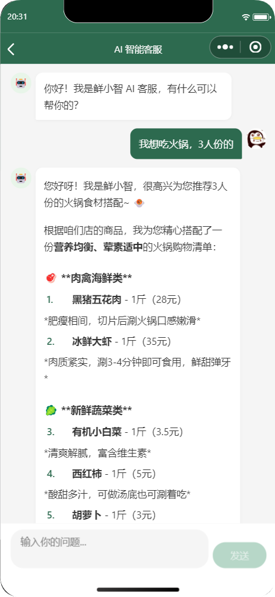

订单列表 :arrow_right: 订单详情 :arrow_right: 收货地址
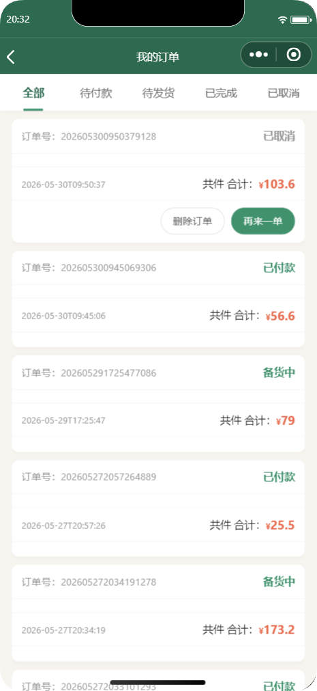 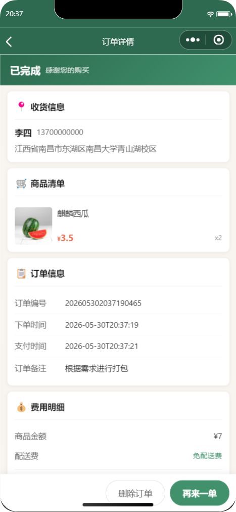 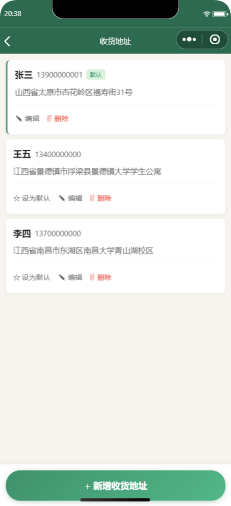

管理后台：

数据概览
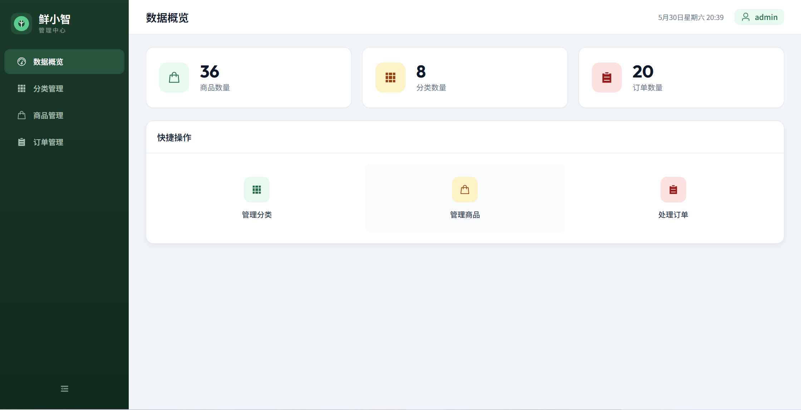

分类管理
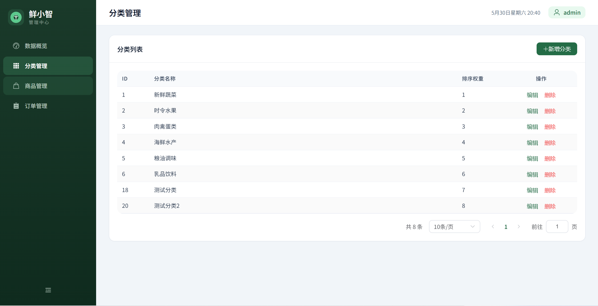

商品管理
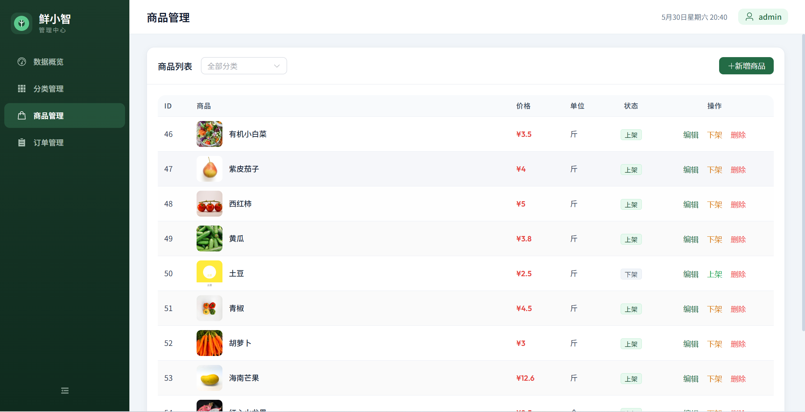

订单管理
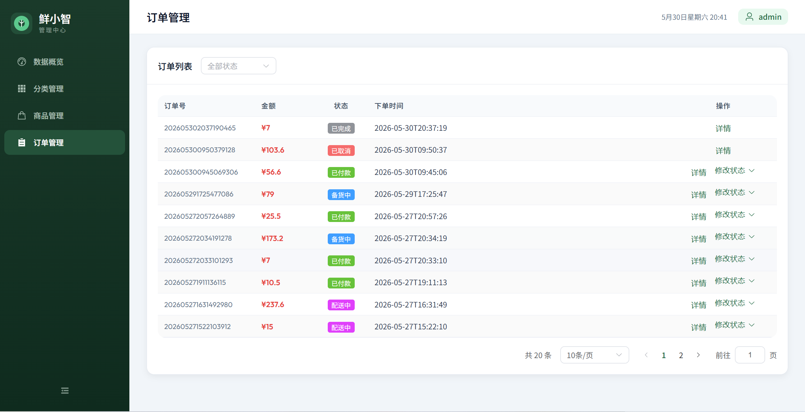


> 有任何问题，可联系本人QQ邮箱：942602922@qq.com
